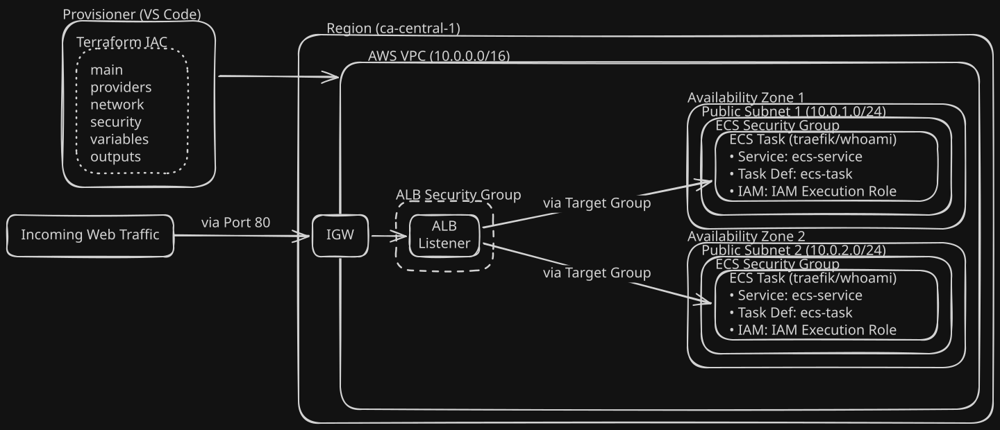
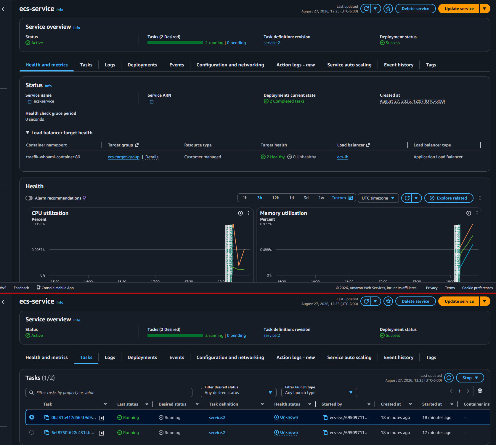
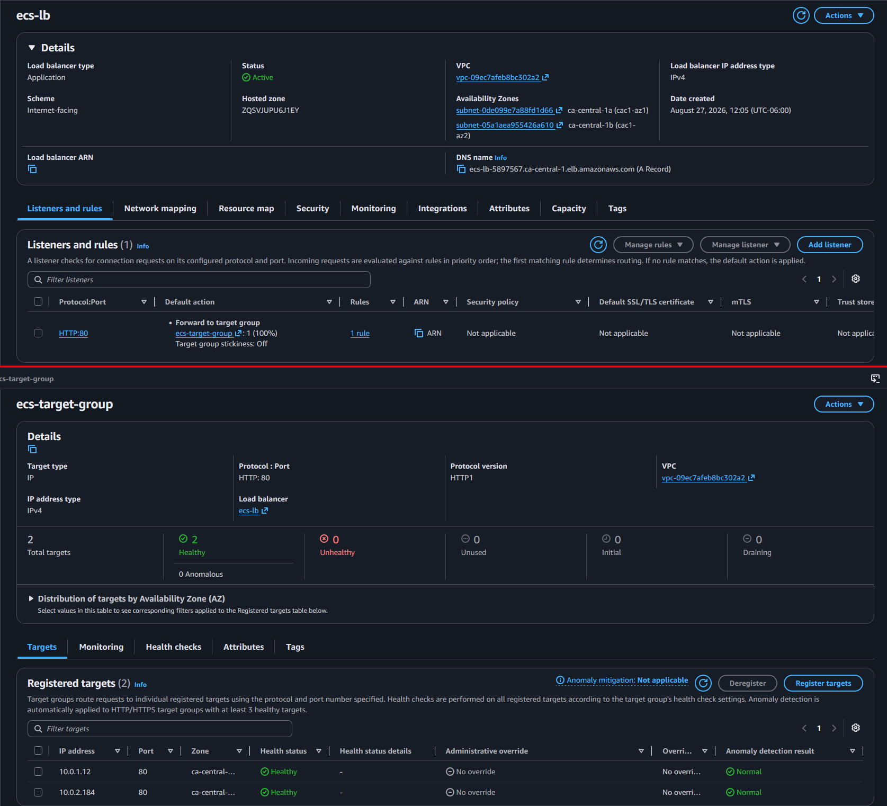
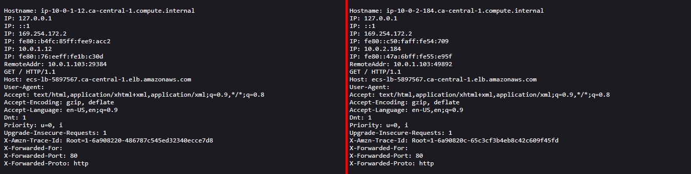

<a id="readme-top"></a>
# Elastic Container Service Cluster with an Application Load Balancer Lab

[](https://aws.amazon.com/)
[](https://www.docker.com/)
[](https://www.terraform.io/)

I recently built an automated ALB (Application Load Balancer) and ECS (Elastic Container Service) Fargate cluster hosting a traefik/whoami container image using Terraform locally to provision infrastructure directly to AWS with the assistance of AI. I will go more in detail with the infrastructure built along with future improvements below.

---

## Table of Contents
- [Overview](#overview)
- [Tech Stack](#tech%20stack)
- [Key Features & Infrastructure Decisions](#key%20features%20&%20infrastructure%20decisions)
- [Project Structure](#project%20structure)
- [How to Deploy](#how%20to%20deploy)
- [Verification & Screenshots](#verification%20&%20screenshots)
- [Production Roadmap](#production%20roadmap%20(future%20improvements))
- [Development Approach & AI Usage](#development%20approach%20&%20ai%20usage)

---

## Overview

This application stack is deployed locally using two load balancers deployed across two availability zones (AZ) managing a serverless AWS-managed container orchestration service with a desired maintenance count of two web server containers.

]
<p align="right">(<a href="#readme-top">back to top</a>)</p>

---

## Tech Stack
- **IAC:** Terraform
- **Load Balancer:** AWS ALB 
- **Container platform:** AWS ECS
<p align="right">(<a href="#readme-top">back to top</a>)</p>

---

## Key Features & Infrastructure Decisions

1. **Terraform Automation:** Cloud-vendor neutral declarative application deployment.
2. **Serverless Compute:**  Deployed using AWS ECS Fargate for managed container infrastructure.
3. **High Availability:** Application load balancer distributing traffic and compute resources across multiple AZs.
<p align="right">(<a href="#readme-top">back to top</a>)</p>

---

## Project Structure

```text
├── main.tf
├── network.tf
├── outputs.tf
├── providers.tf
├── security.tf
├── variables.tf
├── docs/screenshots
│   └── ecs_service.png
│   └── lb_tg.png
│   └── load_balancer_output.png
└── README.md
```
<p align="right">(<a href="#readme-top">back to top</a>)</p>

---
## How to Deploy

The provisioning and application deployment is fully automated locally via Terraform as the provisioner:

1. **Initialize Terraform (Dry Run):**
``` bash
   terraform init && terraform plan
```
2. **Apply Configuration:**
``` bash
   terraform apply
```

<p align="right">(<a href="#readme-top">back to top</a>)</p>

---

## Verification & Screenshots

### AWS ECS Fargate Deployment & Health Topology
*The red highlighted sections are separate sanitized screenshots of the successful ECS Service dashboard, Load Balancer Target Group dashboard, and the output of the two traefik/whoami hosted containers.*
### ECS Service

]
### Load Balancer Target Group

]
### Container Output

]

<p align="right">(<a href="#readme-top">back to top</a>)</p>

---

## Production Roadmap (Future Improvements)

- **Production Deployment:** 
	- Design and deploy a production-ready load balancer with appropriate containerized applications.
	- Implement a CI/CD pipeline workflow via GitHub Actions
	- HTTPS Functionality: automate SSL/TLS certificate renewals to enable secure traffic via port 443. 
- **Code Block Templating:** Optimize HCL files for reusable, template-ready code for faster  development turnover. 
<p align="right">(<a href="#readme-top">back to top</a>)</p>

---

## Development Approach & AI Usage

This project was built and executed using a combination between an **AI-assisted workflow** (leveraging LLMs as a collaborative pair-programmer) and free online courses.
- **Architecture & Ownership:** All system design choices (networking, security, IAM roles, etc.) were directed human-in-the-loop.
- **AI Utility:** Cross-referencing documentation, code & diagram review.
<p align="right">(<a href="#readme-top">back to top</a>)</p>

---